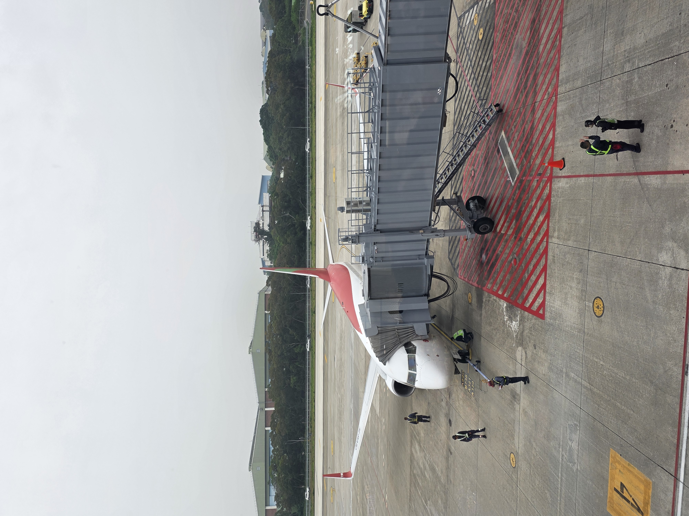

## 旅途中的語言觀察

這是一篇 **MDX 測試文章**。之後正式導入 TinaCMS 時，文章會以 Markdown 或 MDX 儲存在 `content/posts` 裡。

段落可以包含 *斜體*、**粗體**，也可以放入 [外部連結](https://tina.io/)。

_圖說：這是舊旅遊文章留下的封面圖片，先用來驗證圖片顯示。_

<iframe
  width="100%"
  height="420"
  src="https://www.youtube.com/embed/dQw4w9WgXcQ"
  title="YouTube video player"
  allow="accelerometer; autoplay; clipboard-write; encrypted-media; gyroscope; picture-in-picture"
  allowfullscreen
></iframe>
